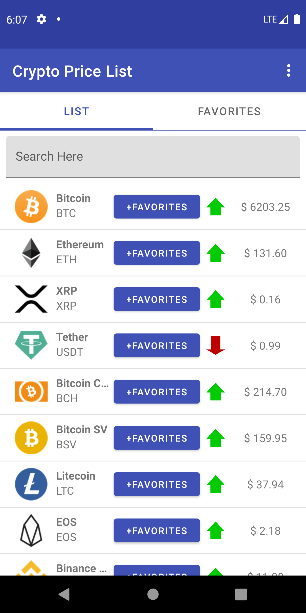
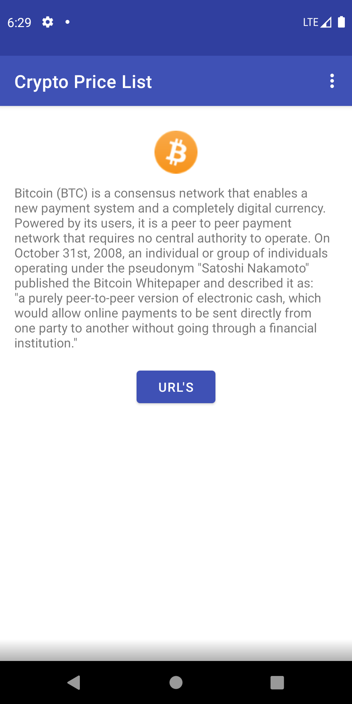
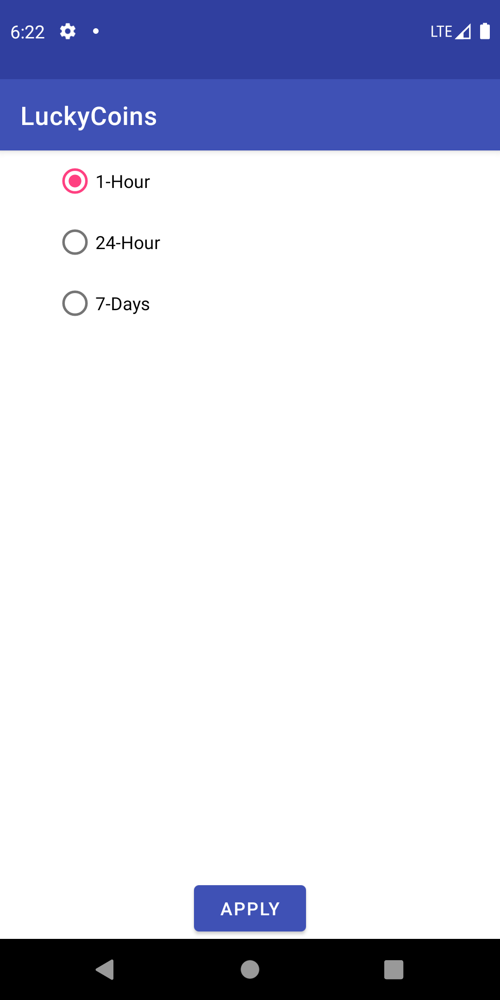

# Lucky-Coins
Simple Android App using CoinMarketCap API and a few extra libraries. This is just a constant WIP really, first app I
built and will probably come back to this and try new things every now and then. Fork this and do what
you will.

Sections
--------

- [API](#CoinMarketCap-API)
- [Libraries](#Libraries)
- [App Details](#App-Details)

# CoinMarketCap-API
API Key is stored on local machine at [~/.gradle/gradle.properties], if you are attempting to build this project you
must generate your own API Key at 
[Coin Market Cap](coinmarketcap.com/api)

# Libraries
[x] RxJava2  
[x] Room  
[x] Jetpack  
[x] Koin  
[x] Karakum(base classes and ext. methods)  

# App-Details

I chose to use the MVVM pattern with this app, therefore each screen follows the same pattern. 

MainActivity:
    The MainActivity has a host tabbed controller to navigate between list and favorites.

    List Controller:

The list controller is basically the view, communicating with the view model which calls the repository and makes the
 api calls to fetch the coin info list and images. There is a local DB for storing favorites.
 

 
    Detail Controller:

    Settings Activity:

The settings activity uses an RxBus to communicate the action across lifecycles. 
    

